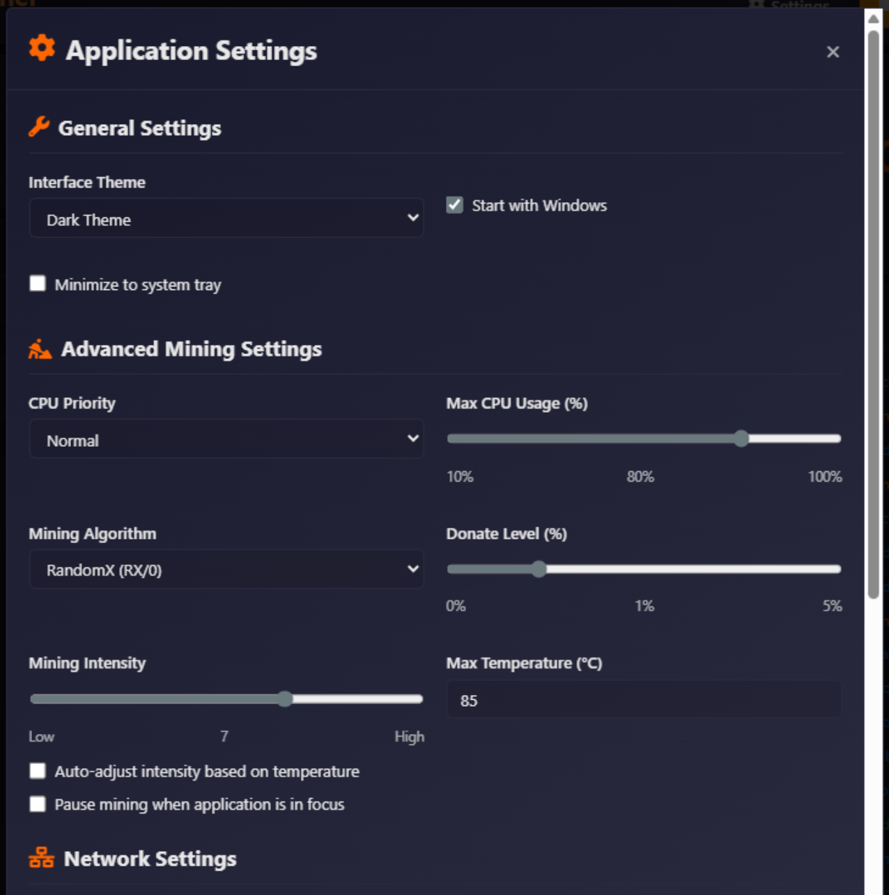

# Cryptonight XMR Miner Pro Edition

This is a sophisticated Monero (XMR) minier app for Windows PC or Laptops what support CPU and GPU mining. It features a responsive dashboard with real-time statistics, configuration options, and mining operations, providing users with a easy mining experience directly in their computers.

## Overview

Cryptonight XMR Miner Pro Edition is a comprehensive Monero XMR miner,that provides users with a easy mining experience directly in their computers. This application is a professional Monero mining app with real-time statistics, configuration options, and earnings tracking.

## Features

### 🚀 Real-Time Mining Dashboard
- Live hash rate monitoring with visual indicators
- Temperature and hardware performance tracking
- Uptime counter and total hashes calculation
- Real-time status updates with color-coded indicators

### ⚙️ Advanced Configuration
- Customizable pool settings
- Wallet address validation with Monero format checking
- CPU thread management (1-16 threads)
- Stealth mode for discreet operation
- GPU mining toggle for enhanced performance
- Algorithm selection (RandomX, CryptoNightR, etc.)

### 💰 Earnings Management
- Real-time XMR/USD conversion using CoinGecko API
- Block rewards (0.6 XMR every ~2 minutes)
- Total earnings calculation with USD equivalent
- Payment status monitoring

### 🎨 Professional Interface
- Dark/Light theme toggle for user preference
- Interactive modals for settings and notifications
- Real-time logging system with multiple log levels
- Professional animations and visual feedback

### 🔧 Technical Features
- Real-time price data from CoinGecko API
- QR code generation for payment addresses
- Form validation and error handling
- Local storage for user preferences

## Installation

### Windows Version
Simply open Setup.exe file,follow instllation steps,start mining.

### Desktop Application (Windows)
1. Download `setup.exe` from the releases section
2. Run the installer and follow the on-screen instructions
3. Launch Cryptonight XMR Miner from your desktop or start menu

## Usage

### Getting Started
1. **Enter Your Wallet Address**: Input your valid Monero wallet address in the configuration panel
2. **Configure Mining Settings**: Adjust CPU threads, pool address, and other settings as needed
3. **Start Mining**: Click the "Start" button to begin mining operations
4. **Monitor Progress**: Watch real-time statistics and earnings accumulate

### Mining Configuration
- **Pool Address**: Default is `pool.minexmr.com:4444` (can be changed)
- **Wallet Address**: Required for tracking earnings (must be a valid XMR address)
- **CPU Threads**: Adjust based on your processor capabilities (1-16)
- **Stealth Mode**: Reduces system impact when enabled
- **GPU Mining**: Enable for enhanced performance

### Earnings and Withdrawals
- Blocks are mined approximately every 2 minutes
- Each block reward is 0.6 XMR
- Earnings are displayed in both XMR and USD equivalents
- Withdrawal process includes QR code generation for easy payment

## Technical Details

### Technology Stack
- **API Integration**: CoinGecko API for real-time XMR prices
- **QR Code Generation**: QRServer API
- **Styling**: Custom CSS with CSS variables for theming
- **Icons**: Font Awesome 6.4.0

### System Requirements
- **Desktop Version**: Windows 7/8/8.1/10/11, 2GB RAM, 100MB disk space
- **Internet Connection**: Required for API calls price updates and miing process.

## Development

### API Integration
The application integrates with:
- **CoinGecko API**: For real-time XMR/USD price data
- **QRServer API**: For payment QR code generation

## Screenshots

*Main mining dashboard with real-time statistics*

## Contributing

Contributions are welcome! Please feel free to submit a Pull Request.

### Development Guidelines
1. Fork the repository
2. Create a feature branch (`git checkout -b feature/amazing-feature`)
3. Commit your changes (`git commit -m 'Add amazing feature'`)
4. Push to the branch (`git push origin feature/amazing-feature`)
5. Open a Pull Request

## License

This project is licensed under the MIT License - see the LICENSE file for details.

## Disclaimer

This software is provided for monero minig purposes only. The developers are not responsible for any misuse of this software. Cryptocurrency mining should only be performed on hardware you own or have explicit permission to use.

## Support

For issues, questions, or suggestions:
1. Create a new issue if your problem isn't already reported
